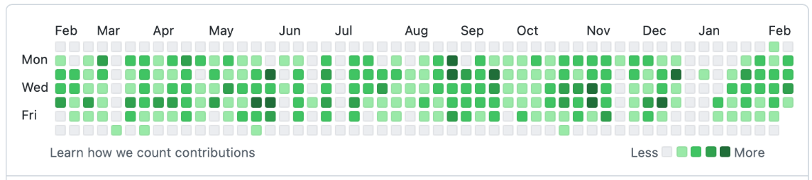

# Cyclopath

__Definition:__  Cycopath A person suffering from chronic bike riding disorder with abnormal urges to ride and feel free

## Goal:

- a workout app that focuses on cycling. The app is meant to combine multiple features from existing
  apps into a single app.
- This is a work in progress project with the following goal features
- main features:
    - [x] Sync activities from Garmin Connect
    - [x] Display weather info for every activity especially wind direction and speed
    - [x] Display the workout static map
    - [ ] Monitor and display user progress over time  (in progress)
      
    - [ ] plan and save routes using maps and weather forecast
- Nice-to-have features:
    - [ ] record activities from within app
    - [ ] add pictures to activities
    - [ ] personal heatmap with a game aspect to explore your city
    - [ ] make maps interactive
    - [ ] overlay speed or Heart Rate on map

## API:

### Users

```markdown
auth/register [POST]
auth/signin [POST]
/signout [POST]
```

### Activity

```md
/activity/list [GET]
/activity/{ID} [GET]
/activity/{ID}/map [GET] // redirects to s3 download link
/activity/post [POST] (not implemented yet)
```

### Progress/Stats

[In Progress]

```md
/athlete/{ID}/zones [GET]
the amount of time spent in each zone
/athlete/{ID}/stats [GET]
longest distance, number of activities, etc.
```

## Schemas

### Dynamo DB Single Table:

| Primary Key | Sort Key     | Attributes                                                                                  |
| ----------- | ------------ | ------------------------------------------------------------------------------------------- |
| UserUUID    | PROFILE      | {Username:STRING, Email: STRING, Password:STRING, ID:LONG, weight:FLOAT, Hight(cm):INT,...} |
| UserUUID    | STATS        | {LongestRideID:LONG, numActivities:INT, ...}                                                |
| UserUUID    | ACTIVITY#ID  | {Name, CreationTime, Distance, CaloriesBurned, Comments, weather:Weather}                   |
| UserUUID    | ROUTE#ID     | {geoJSON_zip[] }                                                                            |
| UserUUID    | ACTIVITYLIST | {Activity1ID,Activity2ID,...}                                                               |

### S3 key:

```
 <UserUUID>#<ActivitiyID>
```
