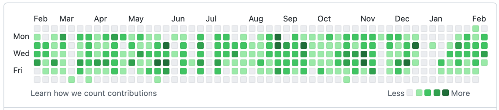

# Cyclopath

- a workout app that focuses on cycling. The app is meant to combine multiple features from existing
  apps into a single app.
- main features:
    - Sync activities from Garmin Connect
    - Display weather info for every activity especially wind direction and speed
    - Display the workout map in addition to Heart Rate data and speed/section
    - Monitor and display user progress over time
      
    - plan and save routes using maps and weather forecast
- Nice-to-have features:
    - record activities from within app
    - add pictures to activities
    - personal heatmap

## API:

### Users

```markdown
/register [POST]
/signin [POST]
/signout [POST]
```

### Activity

```md
/activity/list [GET]
/activity/{ID} [GET]
/activity/post [POST] (in the future)
```

### Progress/Stats

```md
/athlete/{ID}/zones [GET]
the amount of time spent in each zone
/athlete/{ID}/stats [GET]
longest distance, number of activities, etc.
```

## Schemas

### Dynamo DB Single Table

| Primary Key   | Sort Key         | Attributes                                                                                  |
|---------------|------------------|---------------------------------------------------------------------------------------------|
| UserID:UNIQUE | Profile#USERNAME | {Username:STRING, Email: STRING, Password:STRING, ID:LONG, weight:FLOAT, Hight(cm):INT,...} |
| UserID:UNIQUE | Stats            | {LongestRideID:LONG, numActivities:INT, ...}                                                |
| UserID:UNIQUE | Activiy#ID       | {Name, CreationTime, Distance, CaloriesBurned, Comments, Route:geoJSON}                     | 

